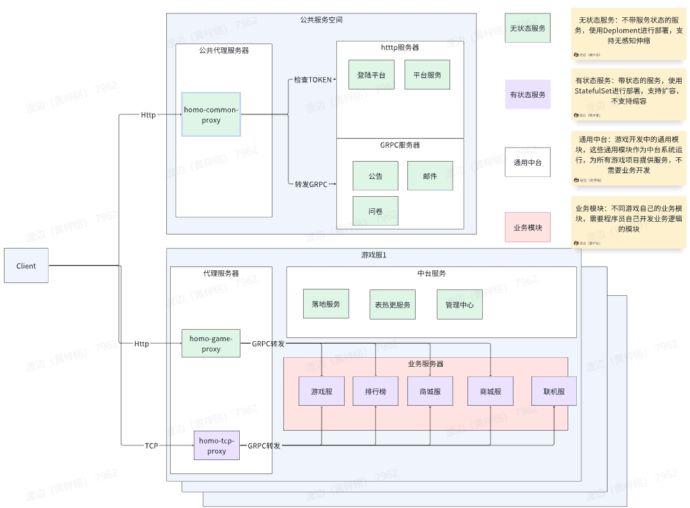

# homo-game

## 简介
### java游戏服务器框架，针对游戏开发场景设计的全响应一站式分布式框架
```text
  homo-game是基于homo-core开发的一系列游戏功能模块，用于搭建整个分布式游戏服务的基本骨架，并提供一些默认的实现，用户可根据自己实际
的业务需要进行开发及定制。该框架指在实现一套游戏服务场景的通用解决方案，满足不同游戏设计场景需求，如SLG,MMO,RPG,棋牌类游戏等。
```
## 系统架构图

## 模块介绍
- ### Homo-common-proxy (公共服代理服务)
  - [使用文档](docs/homo_common_proxy.md) 
  - [Homo-common-proxy](homo-common-proxy)
- ### Homo-game-proxy (Http转发代理)
  - [使用文档](docs/homo_game_proxy.md) 
  - [Homo-game-proxy](homo-game-proxy)
- ### Homo-tcp-proxy (Tcp转发代理)
  - [使用文档](docs/homo_tcp_proxy.md) 
  - [Homo-game-stateful-proxy](homo-game-stateful-proxy)
- ### Homo-game-persistent-server (落地服务)
  - [使用文档](docs/homo_persistent.md) 
  - [Homo-game-persistent-server](homo-game-persistent-server)
- ### Homo-game-login 
  - [Homo-game-login](homo-game-login)
  登陆服务，仅供参考实现，实际根据游戏自身业务开发
- ### Homo-game-activity-core
  - [Homo-game-activity-core](homo-game-activity-core)
  活动框架核心，迭代中

## 依赖工程
- homo-core【github】： [github.com/HZ00M/homo-core](https://gitee.com/Hzoom/homo-core)
- homo-core【gitee】： [github.com/HZ00M/homo-core](https://gitee.com/Hzoom/homo-core)