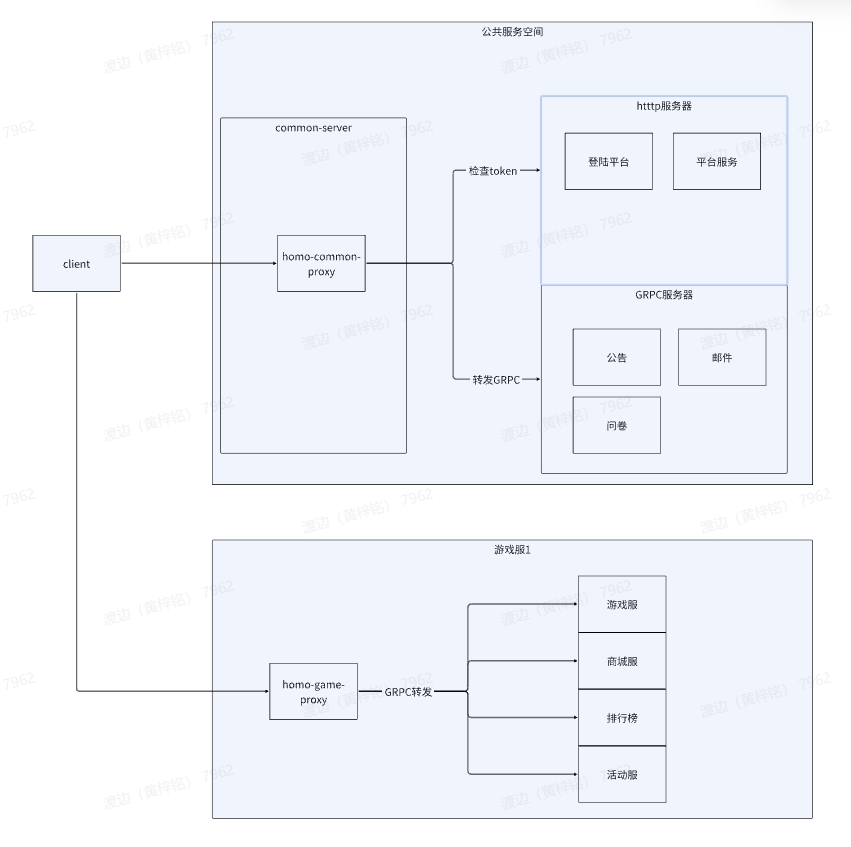

# 中台homo-game-proxy文档
## 设计目标 
**homo-game-proxy**
用与接入客户端传入的消息，并转发到内部业务服务器
## 简述

**homo-game-proxy**提供基于homo-core框架的GRPC的消息转发。

**http://homo-game-proxy:31506**proxy地址 

### 服务关系图




### 概念说明 
+ **homo-game-proxy**
    + 对外提供消息转发服务
#### 消息头headers
    String X_HOMO_APP_ID = "X-Homo-App-Id";
    String X_HOMO_TOKEN = "X-Homo-Token";
    String X_HOMO_USER_ID = "X-Homo-User-Id";
    String X_HOMO_CHANNEL_ID = "X-Homo-Channel-Id";
    String X_HOMO_SIGNATURE = "X-Homo-Signature";
    String X_HOMO_RESPONSE = "X-Homo-Response";
    String X_HOMO_RESPONSE_TIME = "X-Homo-Response-Time";
+ **非游戏业务**

| 参数名          | 说明           | 示例                                  |
| --------------- | -------------- | ------------------------------------- |
| X-Homo-App-Id    | 游戏id         | heads.put("X-Homo-App-Id", "1000004"); |
| X-Homo-Signature | 经过计算的sign | heads.put("X-Homo-Signature", "sign"); |

+ **游戏业务带token**

| 参数名           | 说明                | 示例                                     |
| ---------------- | ------------------- | ---------------------------------------- |
| X-Homo-App-Id     | 游戏id              | heads.put("X-Homo-App-Id", "1000004");    |
| X-Homo-Token      | 玩家的登录后的token | heads.put("X-Homo-Token", "token");       |
| X-Homo-User-Id    | 与token绑定的userId | heads.put("X-Homo-User-Id", "1000004_2"); |
| X-Homo-Channel-Id | 渠道id              | heads.put("X-Homo-Channel-Id", "2");      |

+ srcService：提供服务的服务名，需要带端口，如configCenterService
+ msgId：消息id，如getTableRecord
+ msgContent：转发的业务需求的数据，具体数据根据业务的文档确定

## 使用说明 
 
#### url选择 
+ http://homo-game-proxy:31506/clientMsgProxy 用于处理proto协议的转发
+ http://homo-game-proxy:31506/clientJsonMsgProxy 用于处理json协议的转发
## 请求协议
```protobuf
//客户端发送消息的封装
message ClientRouterMsg {
  string appId =1;
  string srcService = 2;
  string token = 3;
  string userId = 4;
  string channelId = 5;
  string msgId = 6;
  string sign = 7;
  string entityType = 8;
  repeated bytes msgContent = 9;
}

message ParameterMsg {
  string userId   = 1;
  string channelId     = 2;
}

message ClientRouterHeader{
  map<string,string> headers = 1;
}
//返回给客户端的消息封装
message Msg{
  string msgId        = 1;   //消息id
  bytes msgContent   = 2;   //业务返回的结构
  int32 code = 3;//错误码
  string codeDesc = 4; //错误描述
}

```
### 举例1：无状态路由

```java
        TestReq httpTestReq = TestReq.newBuilder().setSign("sign").setChannelId("channelId").build();
        ClientRouterMsg clientRouterMsg = ClientRouterMsg.newBuilder()
                .setSrcService("entity-test-service")
                .setMsgId("testProto")
                .addMsgContent(httpTestReq.toByteString())
                .setSign("52f633ec818319aac1180cbcbece882c")
                .setToken("token")
                .setUserId("123")
                .setChannelId("channel")
                .setAppId("1")
                .build();
        Msg responseBody = webTestClient.post()
                .uri(GAME_PROXY_URL + "clientMsgProxy")
                .headers(httpHeaders -> {
                    for (Map.Entry<String, String> entry : frameHeader.entrySet()) {
                        httpHeaders.set(entry.getKey(), entry.getValue());
                    }
                    httpHeaders.set("Content-Type", "application/x-protobuf");
                })
                .body(BodyInserters.fromValue(clientRouterMsg.toByteArray()))
                .exchange()
                .expectBody(Msg.class)
                .returnResult()
                .getResponseBody();
```
### 有状态的Entity协议
```protobuf
message EntityRequest{
  int64 session = 1;
  string type = 2;
  string id = 3;
  string funName = 4;
  string srcName = 5; //需要再考虑下
  repeated bytes content = 6;
}

message EntityResponse{
  int64 session = 1;
  string type = 2;
  string id = 3;
  string funName = 4;
  repeated bytes content = 6;
}
```
### 举例2：基于有状态的Entity路由
（有状态路由会基于用户id分发到固定的pod进行处理）
```java
TestReq testReq = TestReq.newBuilder().setToken("123").setSign("2313").build();
        EntityRequest entityRequest = EntityRequest.newBuilder().setType("user").setFunName("test").setSrcName("client").addContent(testReq.toByteString()).build();
        ClientRouterMsg clientRouterMsg = ClientRouterMsg.newBuilder()
                .setSrcService("entity-test-service")
                .setEntityType("user")
                .setMsgId("entityCall")
                .addMsgContent(entityRequest.toByteString())
                .setSign("52f633ec818319aac1180cbcbece882c")
                .setToken("token")
                .setUserId("123")
                .setChannelId("channel")
                .setAppId("1")
                .build();
        Msg responseBody = webTestClient.post()
                .uri(GAME_PROXY_URL + "clientMsgProxy")
                .headers(httpHeaders -> {
                    for (Map.Entry<String, String> entry : frameHeader.entrySet()) {
                        httpHeaders.set(entry.getKey(), entry.getValue());
                    }
                    httpHeaders.set("Content-Type", "application/x-protobuf");
                })
                .body(BodyInserters.fromValue(clientRouterMsg.toByteArray()))
                .exchange()
                .expectBody(Msg.class)
                .returnResult()
                .getResponseBody();
        EntityResponse response = EntityResponse.parseFrom(responseBody.getMsgContent().toByteArray());
        TestRsp testRsp = TestRsp.parseFrom(response.getContent(0));
```

### Json协议转发
### json协议
```java
public class ClientJsonRouterMsg implements Serializable {
    String serviceName;
    Integer podIndex;
    String msgId;
    String msgContent;
}
```
### 举例3：json消息路由
```java
JSONObject param = new JSONObject();
param.put("param1", 1);
param.put("param2", "test");
ClientJsonRouterMsg clientRouterMsg = ClientJsonRouterMsg.builder()
        .serviceName("entity-test-service:11555")
        .msgId("testJson")
        .msgContent(param.toJSONString())
        .podIndex(0)
        .build();
String responseBody = webTestClient.post()
        .uri(GAME_PROXY_URL + "clientJsonMsgProxy")
        .headers(httpHeaders -> {
            for (Map.Entry<String, String> entry : frameHeader.entrySet()) {
                httpHeaders.set(entry.getKey(), entry.getValue());
            }
            httpHeaders.set("Content-Type", "application/json");
        })
        .body(BodyInserters.fromValue(JSON.toJSONBytes(clientRouterMsg)))
        .exchange()
        .expectBody(String.class)
        .returnResult()
        .getResponseBody();
```