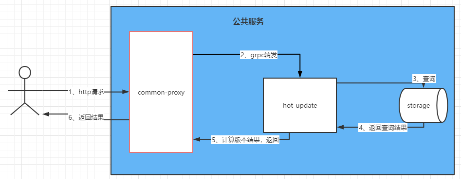
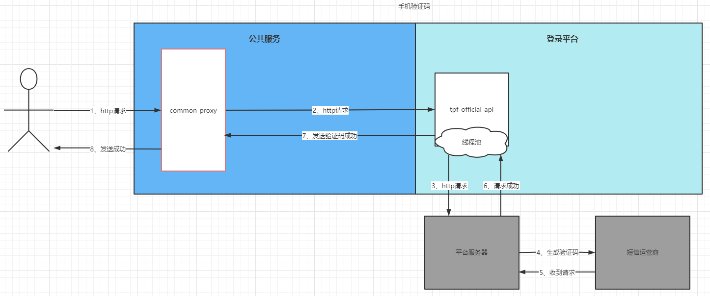
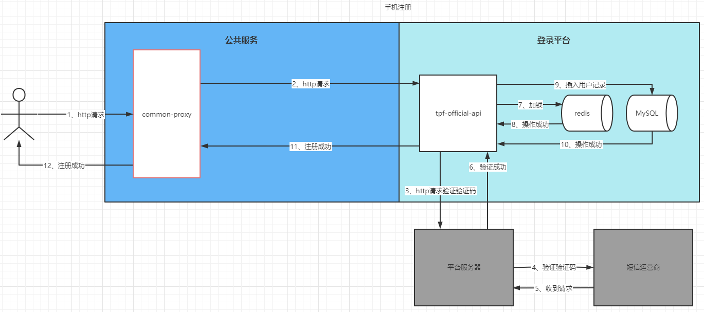
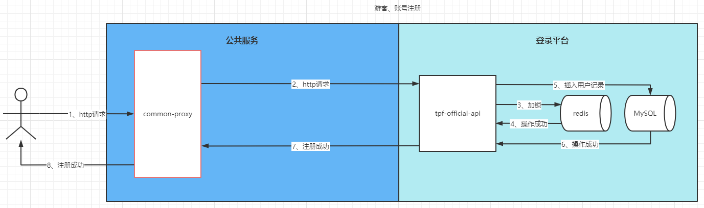
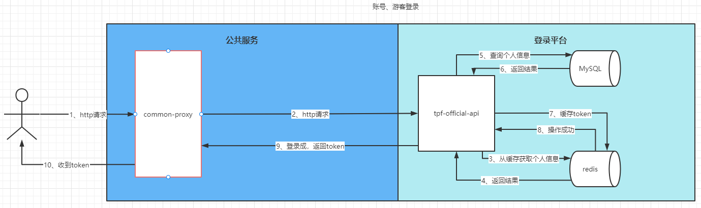
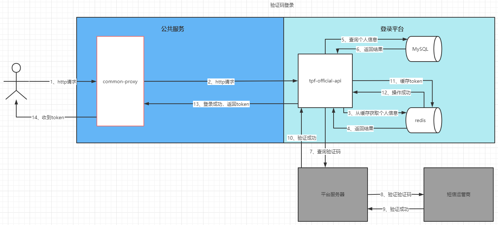
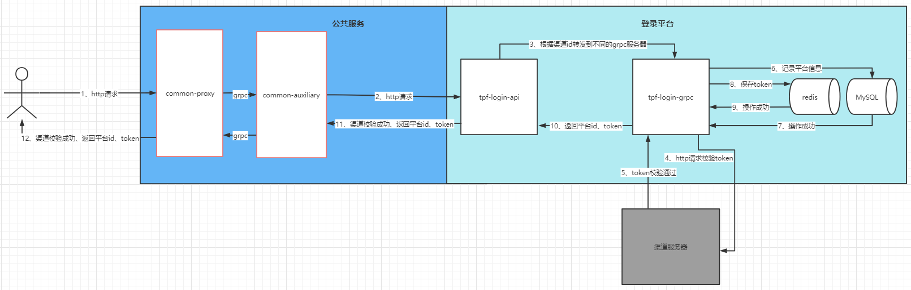
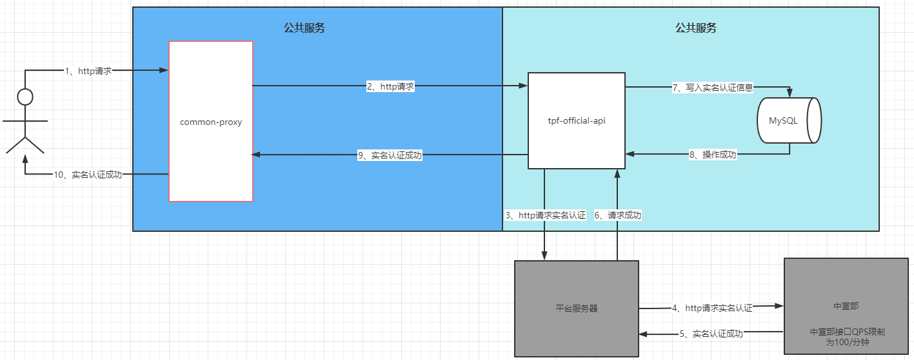
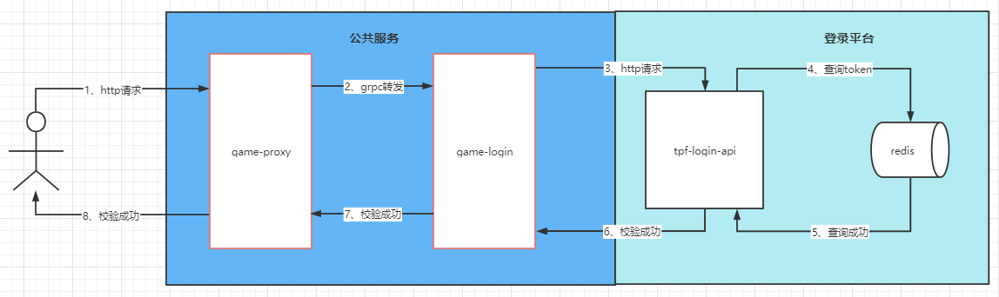
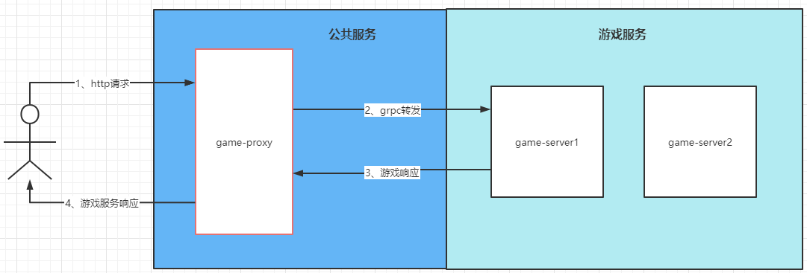

# SDK登录全流程

### 1、热更新

> SDK打开客户端，如果有接入热更新服务器，第一条请求为热更新拉取请求

### 2、手机验证码

> 当用户选择手机注册时，会请求手机验证码

### 3、注册

> 注册分三种，游客注册、账号注册、手机注册

#### 3-1手机注册

#### 3-2游客、账号注册

### 4、登录

> 官方渠道验证账号密码，返回登录之后的token

#### 4-1游客账号登录

#### 4-2验证码登录

> 验证码登录相较于账号登录，增加了http请求平台验证码是否正确的操作

### 5、渠道校验

> 用户拿到登录后的token后，带着渠道id去登录平台校验渠道token，校验成功后返回平台唯一id和token

### 6、实名认证

> 实名认证调用平台接口，平台请求中宣部接口

### 7、平台校验

> 渠道校验成功后，客户端获取的token和平台id，请求game-proxy服务，game-proxy会用token和id进行鉴权

### 8、转发游戏协议

> game-login校验通过之后，开始转发grpc请求到对应的service

