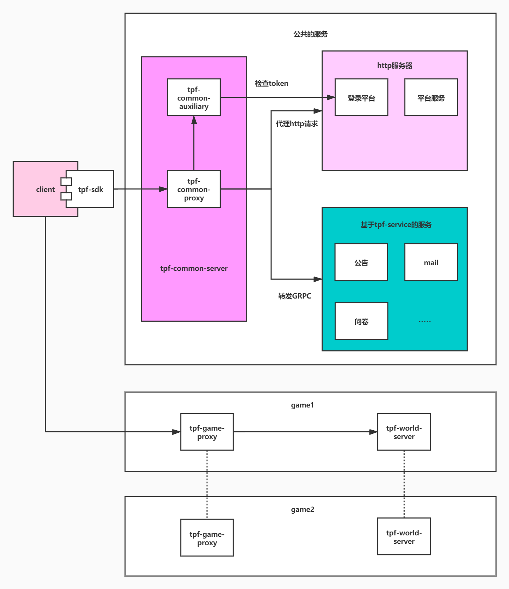
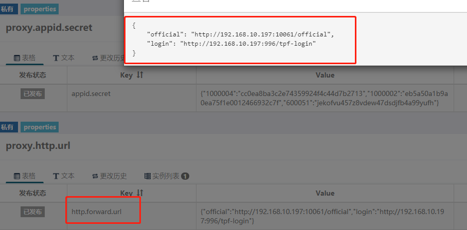
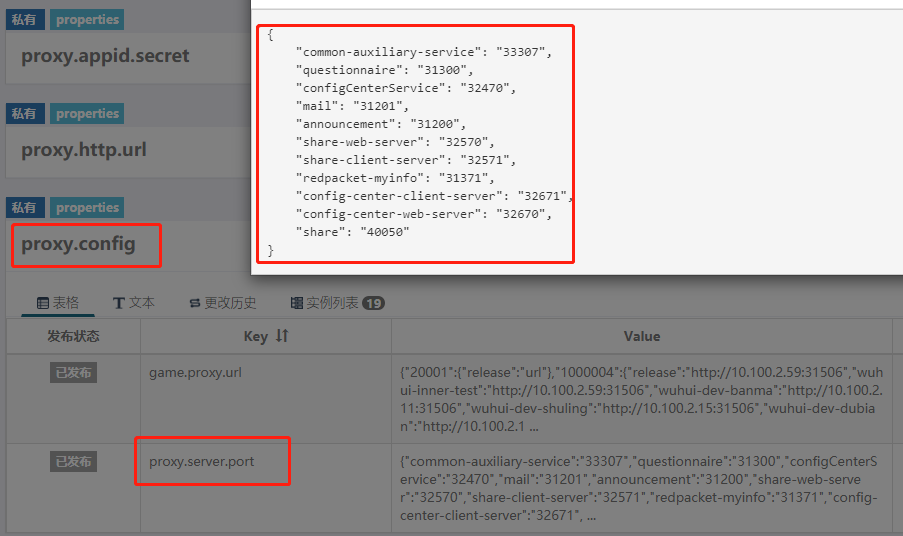
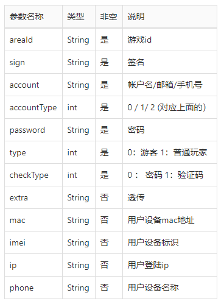
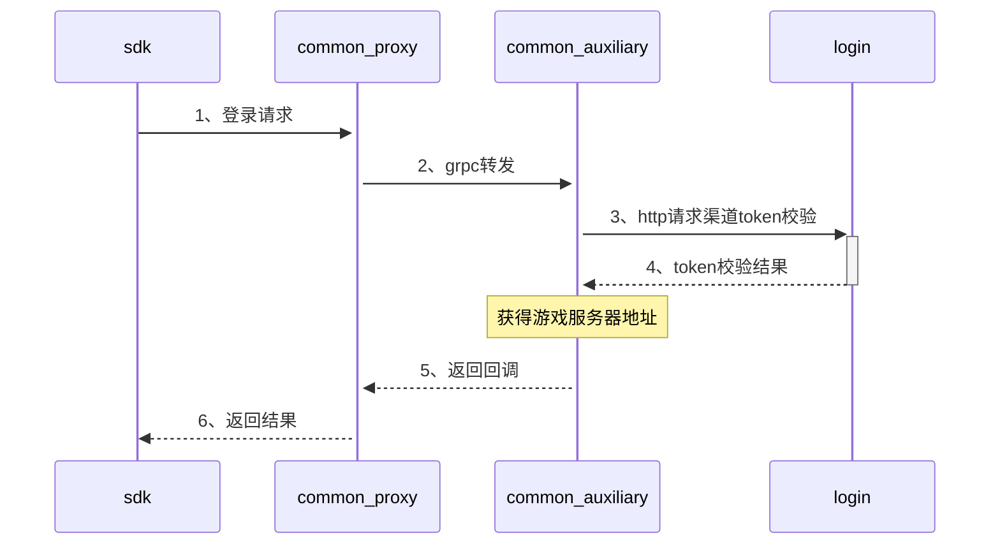
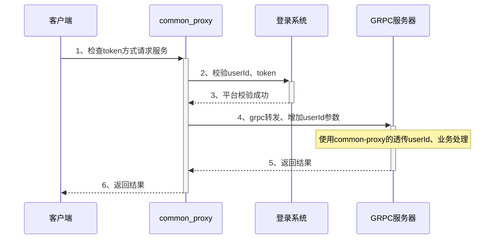
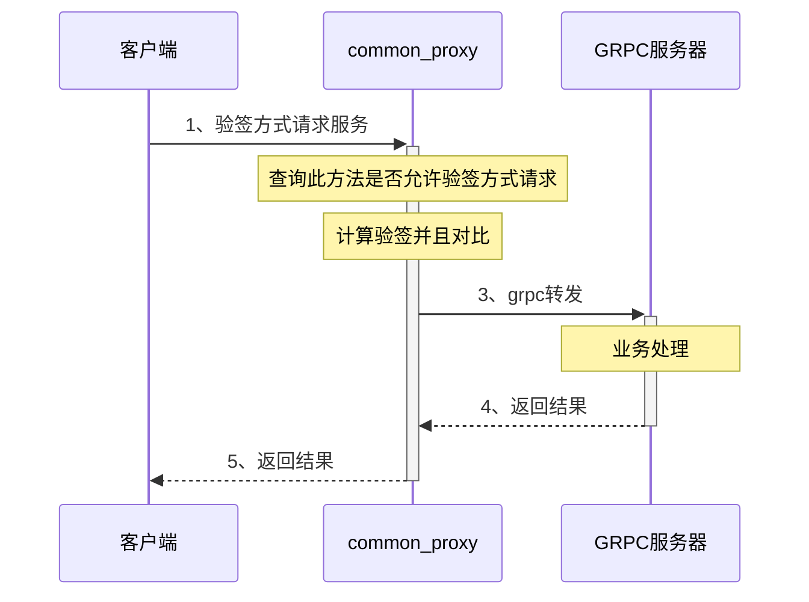
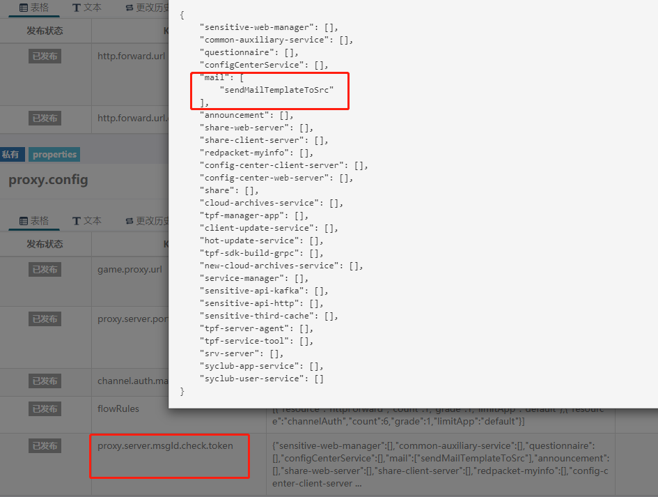
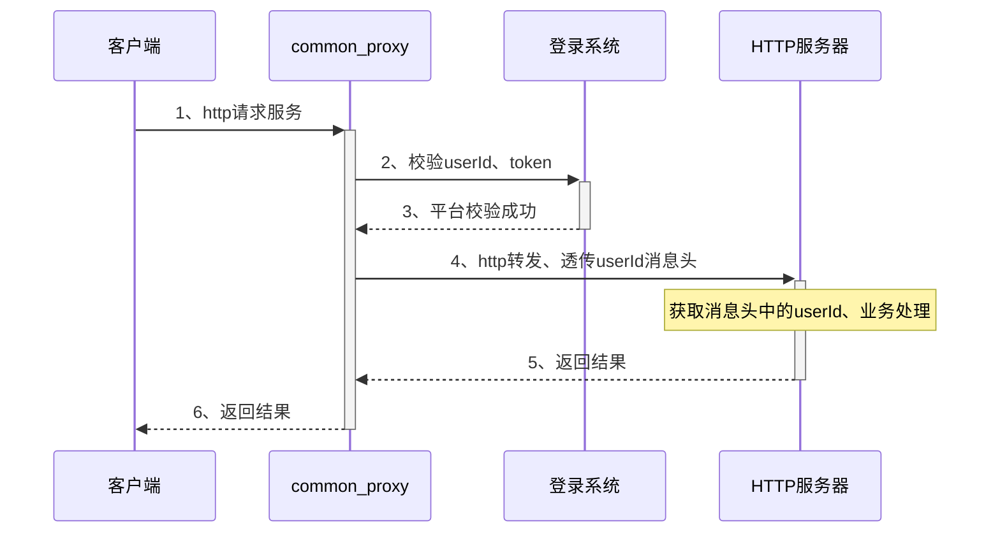
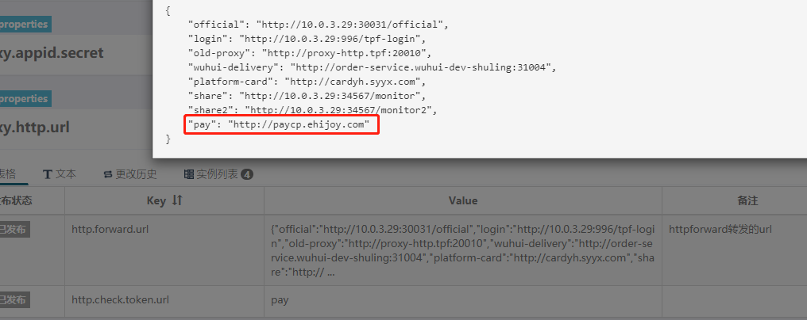

# 中台tpf-common-proxy文档

## 设计目标

**tpf-common-proxy**用来对接所有的公共的中台服务，如邮件、公告、问卷等，主要功能是根据业务的需求转发对应的服务，目的是减少游戏的配置，不需要配置和管理多个服务的地址，在对接时只需要协商服务名和消息id即可。

## 简述

**tpf-common-proxy**提供基于tpf-service框架的GRPC的消息转发和http请求代理。

**http://inner-common-proxy.sygame.com:33306**内网proxy地址

**http://common-proxy.syyx.com:33306**现网proxy地址

### 服务关系图



### 概念说明

+ **tpf-common-server   中台proxy及辅助的服务**
  + 对外暴露的唯一proxy服务器，接受http请求，提供服务代理和转发的功能
+ **http服务器**
  + 对外提供http服务的服务器
+ **基于tpf-service的服务器**
  + 中台服务

## 使用说明

### 基于tpf-service服务的转发

#### 验证的选择

proxy不做业务上的设置，提供两种验证方式

+ 对发起者的token进行验证
+ 用key加密生成sign，验证sign的正确性

#### 消息头headers

+ **游戏业务带token**

| 参数名           | 说明                | 示例                                     |
| ---------------- | ------------------- | ---------------------------------------- |
| X-Tpf-App-Id     | 游戏id              | heads.put("X-Tpf-App-Id", "1000004");    |
| X-Tpf-Token      | 玩家的登录后的token | heads.put("X-Tpf-Token", "token");       |
| X-Tpf-User-Id    | 与token绑定的userId | heads.put("X-Tpf-User-Id", "1000004_2"); |
| X-Tpf-Channel-Id | 渠道id              | heads.put("X-Tpf-Channel-Id", "2");      |

+ **非游戏业务**

| 参数名          | 说明           | 示例                                  |
| --------------- | -------------- | ------------------------------------- |
| X-Tpf-App-Id    | 游戏id         | heads.put("X-Tpf-App-Id", "1000004"); |
| X-Tpf-Signature | 经过计算的sign | heads.put("X-Tpf-Signature", "sign"); |

#### MediaType

+ application/json：json格式

+ application/x-protobuf：pb格式

#### 消息体body

```json
{
  "srcService": "",
  "msgId": "",
  "msgContent": ""
}
```

+ srcService：提供服务的服务名，需要带端口，如configCenterService
+ msgId：消息id，如getTableRecord

+ msgContent：转发的业务需求的数据，具体数据根据业务的文档确定

#### url选择

+ http://inner-common-proxy.sygame.com:33306/jsonMsgCheckSign：json格式的转发只检查sign

+ http://inner-common-proxy.sygame.com:33306/jsonMsgCheckToken：json格式的转发只检查token

+ http://inner-common-proxy.sygame.com:33306/pbMsgCheckSign：pb格式的转发只检查sign

+ http://inner-common-proxy.sygame.com:33306/pbMsgCheckToken：pb格式的转发只检查token

#### 返回的格式

```json
{
    "code":"",
    "msg":"",
    "msgContent":"",
    "msgId":""
}
```

+ code：proxy返回的错误码，转发消息的结果，1代表成功，其他表示失败
+ msg：失败原因，code不等于1时msg字段的值有意义

+ msgContent：业务返回的结果
+ msgId：消息id，如getTableRecord

#### 错误码

| code | msg               |
| ---- | ----------------- |
| 0    | 通过              |
| 1    | 系统错误          |
| 2    | 参数错误          |
| 3    | 签名错误          |
| 4    | token校验不通过   |
| 5    | http转发url不存在 |
| 6    | 没有配置密钥      |

### http请求代理

> http请求代理是通过common-proxy转发任意的http请求，原封不动的转发客户端的请求头和请求体

#### 特殊的请求头

| 参数名              | 说明                                                         | 示例                                       |
| ------------------- | ------------------------------------------------------------ | ------------------------------------------ |
| X-Tpf-Response-Time | common-proxy发送请求的超时时间，超时common-proxy将不会等待响应，应小于客户端的超时时间，单位毫秒 | heads.put("X-Tpf-Response-Time", "10000"); |


#### apollo配置转发的url

official ----> http://192.168.10.197:10061/official

login   -----> http://192.168.10.197:996/tpf-login

.....



#### 转发

统一的请求地址

**http://inner-common-proxy.sygame.com:33306/httpForward/[key]**（key为在Apollo配置的唯一标识，如official、login）

示例：

原url：**http://192.168.10.197:10061/official**/authentication/login

proxy代理的url：

**http://inner-common-proxy.sygame.com:33306/httpForward/official**/authentication/login

请求方式和消息头保持不变即可

#### 转发原理

proxy会根据配置好的规则，获取到httpForward下一个参数的值

+ 如果是**login**就替换成**http://192.168.10.197:996/tpf-login**
+ 如果是**official**就替换成**http://192.168.10.197:10061/official**

### 内部集群http请求代理

此功能转发集群内部的http服务

#### 地址：

http://inner-common-proxy.sygame.com:33306/serverHttpForward/{servername.namespace}/{port}/{msgId}/**

http://inner-common-proxy.sygame.com:33306/shf/{servername.namespace}/{port}/{msgId}/**

+ servername：集群里的服务名，
+ port：端口号，如果port==”no“，会在Apollo找服务名对应的端口号



### HTTP服务统一域名

#### 地址：

http://inner-common-proxy.sygame.com:33306/httpService/{msgId.servername:port}/{appId}/{regionId}/{channelId}

appId可以用*代替

channelId可以用*代替

### HTTP服务根据regionIndex转发到对应的区服

http://inner-common-proxy.sygame.com:33306/httpServiceForRegionIndex/{msgId.servername:port}/{appId}/{regionIndex}/{channelId}

channelId可以用*代替

## 客户端-SDK登录流程

### 数据准备

#### 渠道登录

因为各渠道的获取渠道token的方式不一样，下面以**官方渠道**为例

原登录url为：**http://192.168.10.197:10061/official**/authentication/login

统一往common-proxy请求的url：

**http://inner-common-proxy.sygame.com:33306/httpForward/official**/authentication/login

#### 渠道登录参数（post请求）



示例

```json
{

  "areaId" : "500",

  "sign" : "432c3f79652b3f264531b6c422e8f62f",

  "account" : "7WiE61U8Zo",

  "accountType" : "0",

  "password" : "",

  "type" : "1",

  "checkType" : "0",

  "imei" : "CCE7CFC6-A92F-4450-A38D-097794C4AF94",

  "extra" : "{\"bdAppId\" : \"1234\"}"

}
```

#### 渠道登录返回数据

```json
{
    "data": {
        "account": "7WiE61U8Zo",
        "actived": 1,
        "areaId": "500",
        "cTime": "1597399018468",
        "id": "18211",
        "identityFlg": "0",
        "loginTime": "0",
        "newAccountFlg": 0,
        "relatePhone": "",
        "ssFlg": "1",
        "token": "b640fa787a63b061737c4b60ccc3980d",   //渠道验证的token
        "tokenL": "ec85dda874f1bd3c47179cf8d8503e26"
    },
    "meta": {
        "errorCode": 0,
        "errorMessage": ""
    }
}
```

### 游戏登录流程图



### 接口说明

+ 1、登录请求参数

  ```json
  {
    "srcService": "common-auxiliary-service",
    "msgId": "channelAuth",
    "msgContent": "[{\"appId\":\"1000004\",\"channelId\":\"2\",\"extension\":\"{\\\"id\\\":\\\"channelId\\\",\\\"token\\\":\\\"token\\\"}\",\"extra\":\"call back for me\",\"logId\":\"test01\",\"namespace\":\"1\",\"sign\":\"casdoi432fef1\"}]"
  }
  ```

  **msgContent**结构：

  | 参数名称    | 类型   | 非空 | 说明                                                         |
  | ----------- | ------ | ---- | ------------------------------------------------------------ |
  | appId       | String | 是   | 游戏id                                                       |
  | channelId   | String | 是   | 渠道id                                                       |
  | extension   | JSON   | 是   | 渠道校验所需参数，各渠道构成参数不同                         |
  | sign        | String | 是   | 签名值； baseStr:  appId={appId}channelId={channelId}{extension}{appKey} |
  | extra       | String | 否   | 透传数据，不做分析，回传                                     |
  | logId       | String | 否   | kafka数据上报需要，为空则不上报                              |
  | regionIndex | String | 是   | 游戏区服Index                                                |
  
+ 6、返回的结果

  ```
  {
      "code":"0",
      "msg":"ok",
      "msgContent":"{"meta":{"errCode":15100,"errMsg":"1002"},"data":null}",
      "msgId":"channelAuth"
  }
  ```

  **msgContent**成功示例

  ```
    {
        meta:{
            errCode： 0，
            errMsg： '操作成功'
        },
        data: {
        	  proxyData: {
                regionId:"wuhui-inner-test",
                gameProxyUrl:"http://10.100.1.19:31506", 
        	  }，
        	  serverData: {
                id: '100_123',
                token: 'test01_token',
                extension: '此处有可能为JSONStr,与渠道确认后，可进行解析',
                extra: 'call back for me'
        	  }
        }
    }
  
  ```

- data.proxyData
  - 返回默认区服信息

## 原proxy协议更改方案

> 以问卷为例

### 原消息头

| 参数名            | 说明                | 示例                                                         |
| ----------------- | ------------------- | ------------------------------------------------------------ |
| X-Tpf-App-Id      | 游戏id              | heads.put("X-Tpf-App-Id", "1000004");                        |
| X-Tpf-Token       | 玩家的登录后的token | heads.put("X-Tpf-Token", "token");                           |
| X-Tpf-Msg-Id      | 消息id              | heads.put("X-Tpf-Msg-Id", "700060100");                      |
| X-Tpf-Provider-Id | 应用id              | heads.put("X-Tpf-Provider-Id", "700060");                    |
| X-Tpf-App-Key     | appKey              | heads.put("X-Tpf-App-Key", "95333c76db1d1aa2c3b81c4ed18ca5de"); |
| X-Tpf-Signature   | 签名                | xxx                                                          |
| X-Tpf-Timestamp   | 时间戳              | heads.put("X-Tpf-Timestamp", System.currentTimeMillis() + ""); |

### 现消息头

| 参数名           | 说明                | 示例                                     |
| ---------------- | ------------------- | ---------------------------------------- |
| X-Tpf-App-Id     | 游戏id              | heads.put("X-Tpf-App-Id", "1000004");    |
| X-Tpf-Token      | 玩家的登录后的token | heads.put("X-Tpf-Token", "token");       |
| X-Tpf-User-Id    | 与token绑定的userId | heads.put("X-Tpf-User-Id", "1000004_2"); |
| X-Tpf-Channel-Id | 渠道id              | heads.put("X-Tpf-Channel-Id", "2");      |

### 原消息体

```
{
  "srcService": "", 
  "msgId": "", 
  "msgContent": ""
}
```

### 现消息体

```
{
  "srcService": "", 
  "msgId": "", 
  "msgContent": ""
}
```

### 原返回数据

```
{
    "msgContent":"",
    "msgId":""
}
```

### 现返回数据

```
{
    "code":"",
    "msg":"",
    "msgContent":"",
    "msgId":""
}
```

## common-auxiliary-service接口

### 获取区服配置

- 服务类型:  **tpf-service**

- 说明: 获取当前游戏的区服和对应game proxy url

- errorCode(String):

  ```
  0: 通过
  100: 系统异常
  200: 参数错误
  201: 区服索引超出当前区服长度
  300: 未配置此应用
  ```

- body

  ```
  {
    "srcService": "common-auxiliary-service",
    "msgId": "loadRegion",
    "msgContent": [序列化后的JsonReqObj]
  }
  JsonReqObj: {
  	"appId":""
  }
  ```
  | 参数名     | 是否必填 | 类型   | 说明      | 示例     |
  | ---------- | -------- | ------ | --------- | -------- |
  | msgContent | 是       | Array  | 请求数组  |          |
  | appId      | 是       | string | 游戏appId | "100004" |

- 返回

  ```
  resp:{
  	errorCode: 
  	errorMsg:
  	regionList:[
  		{
  			"regionId": "fff",
  			"gameProxyUrl":"url"
  		}
  	]
  }
  ```

  
  
  | 参数名     | 类型   | 说明                     |
  | ---------- | ------ | ------------------------ |
  | errorCode  | String | 错误码                   |
  | errorMsg   | String | 错误信息(根据错误码返回) |
  | regionList | List   | 区服列表                 |

### 获取区服简要信息

- 服务类型:  **tpf-service**

- 说明: 获取当前游戏的区服简要信息

- errorCode(String):

  ```
  0: 通过
  100: 系统异常
  200: 参数错误
  300: 未配置此应用
  ```

- body

  ```
  {
    "srcService": "common-auxiliary-service",
    "msgId": "getAllRegionSimpleInfo",
    "msgContent": [序列化后的JsonReqObj]
  }
  JsonReqObj: {
  	"appId":""
  }
  ```
  | 参数名     | 是否必填 | 类型   | 说明      | 示例     |
  | ---------- | -------- | ------ | --------- | -------- |
  | msgContent | 是       | Array  | 请求数组  |          |
  | appId      | 是       | string | 游戏appId | "100004" |

- 返回

  ```
  resp:{
  	errorCode: 
  	errorMsg:
  	simpleRegionList:[
  		{
  			"regionId": "tpfdemo-dev",
  			"name":"技术平台demo1区"
  		}
  	]
  }
  ```

  
  
  | 参数名     | 类型   | 说明                     |
  | ---------- | ------ | ------------------------ |
  | errorCode  | String | 错误码                   |
  | errorMsg   | String | 错误信息(根据错误码返回) |
  | regionList | List   | 区服列表                 |

### 获取区服详细信息

- 服务类型:  **tpf-service**

- 说明: 获取当前游戏的区服简要信息

- errorCode(String):

  ```
  0: 通过
  100: 系统异常
  200: 参数错误
  300: 未配置此应用
  ```

- body

  ```
  {
    "srcService": "common-auxiliary-service",
    "msgId": "getRegionInfoByIndex",
    "msgContent": [序列化后的JsonReqObj]
  }
  JsonReqObj: {
  	"appId":"",
  	"regionIndex":1
  }
  ```

  | 参数名      | 是否必填 | 类型   | 说明      | 示例     |
  | ----------- | -------- | ------ | --------- | -------- |
  | msgContent  | 是       | Array  | 请求数组  |          |
  | appId       | 是       | string | 游戏appId | "100004" |
  | regionIndex | 是       | number | 区服索引  | 1        |

- 返回

  ```
  resp:{
  	errorCode: 
  	errorMsg:
  	regionInfo:{
          "regionId": "tpfdemo-dev",
          "name":"技术平台demo1区",
          "gameProxyUrl":"http://127.0.0.1:31506"
      }
  }
  ```

  

  | 参数名     | 类型   | 说明                     |
  | ---------- | ------ | ------------------------ |
  | errorCode  | String | 错误码                   |
  | errorMsg   | String | 错误信息(根据错误码返回) |
  | regionInfo | Object | 区服详细信息             |


## apollo配置

### application

> 临时增加官方渠道重构流量转发配置

login.http.forward = /httpForward/official/authentication/login,/httpForward/official/authentication/sssss

表示客户端如果发送/httpForward/official/authentication/login、/httpForward/official/authentication/sssss的url将会转发到新的官方渠道服务器

login.reactor.url = http://tpf-official.tpf-inner-login:30031/official

表示新的官方渠道的服务器地址

### appId

tpf-common-server

### 集群

因为配置基本都是公共的，所以每个人公用一个集群

### 命名空间

+ common_login：登录平台的密钥，每个游戏对应一个
+ proxy.appid.secret：proxy计算sign的密钥，用的是旧的proxy的密钥
+ proxy.http.url：配置http代理的url，key为forward后面的参数
+ proxy.config
  + proxy.server.port：中台服务器的端口号

### 默认集群

​		**公共**的命名空间在这里配置

- **tpf.all.region.info**

  - region.info: 所有common-proxy 管理的所有游戏及对应的区服信息都要在这里配置(json格式).

    ```json
    {
      "tpf-common-inner-release": {           //common-proxy所在的apollo 集群
        "50": [                               //游戏的appId (不是apollo appId).每个游戏都有一个服务器区服列表,默认区服请配置在第一位置上
          {
            "name": "技术平台1区",             //区服名(玩家看到的)
            "regionId": "tpfdemo-dev-jiantu", //区服名(命名空间)
            "gameProxyUrl": "http://10.100.1.46:31506"            //游戏proxy 连接地址
          },
          {
            "name": "技术平台1区",
            "regionId": "tpfdemo-dev-shitou",
            "gameProxyUrl": "http://10.100.1.46:31506"
          }
        ],
        "70": [
          {
            "name": "技术平台1区",
            "regionId": "knight-inner-test",
            "gameProxyUrl": "http://10.100.1.59:31506"
          }
        ]
      },
      "wuhui-dev-aisen": {
        "50": [
          {
            "name": "技术平台1区",
            "regionId": "tpf-demo",
            "gameProxyUrl": "http://10.100.2.62:31506"
          }
        ],
        "1000004": [
          {
            "name": "无悔1区",
            "regionId": "wuhui-inner--test",
            "gameProxyUrl": "http://10.100.1.252:31506",
            "gameGrayProxyUrl": "http://10.100.1.253:31506"
          },
          {
            "name": "无悔2区",
            "regionId": "release-2",
            "gameProxyUrl": "http://10.100.1.118:31506"
          },
          {
            "name": "无悔3区",
            "regionId": "tpfdemo-dev-aisen",
            "gameProxyUrl": "http://10.100.1.118:31506"
          }
        ]
      }
    }
    ```


## common-proxy安全性配置

### GRPC转发

> GRPC服务分为两类，用户相关的和非用户相关的


+ 用户相关



云存档、邮件等与玩家个人数据相关的服务需要使用jsonMsgCheckToken接口

在请求头中带上：

| 参数名           | 说明                | 示例                                     |
| ---------------- | ------------------- | ---------------------------------------- |
| X-Tpf-App-Id     | 游戏id              | heads.put("X-Tpf-App-Id", "1000004");    |
| X-Tpf-Token      | 玩家的登录后的token | heads.put("X-Tpf-Token", "token");       |
| X-Tpf-User-Id    | 与token绑定的userId | heads.put("X-Tpf-User-Id", "1000004_2"); |
| X-Tpf-Channel-Id | 渠道id              | heads.put("X-Tpf-Channel-Id", "2");      |

接口需要增加一个参数HeaderMsg：

```java
void getAllPackage(String req, HeaderMsg headerMsg, JsonCallBack jsonRpcBack);
```

HeaderMsg数据结构

```java
public class HeaderMsg implements Serializable {
    /**
     * 用户的token
     */
    private String token;
    /**
     * 用户的id
     */
    private String userId;
    /**
     * 渠道id
     */
    private String channelId;
    /**
     * 游戏id
     */
    private String appId;
}
```

HeaderMsg中的userId是经过平台校验过的合法userId

+ 用户无关



web服务、热更新、拉取配置等服务使用jsonMsgCheckSign接口

在请求头中带上：

| 参数名          | 说明           | 示例                                  |
| --------------- | -------------- | ------------------------------------- |
| X-Tpf-App-Id    | 游戏id         | heads.put("X-Tpf-App-Id", "1000004"); |
| X-Tpf-Signature | 经过计算的sign | heads.put("X-Tpf-Signature", "sign"); |

需要在Apollo配置，不配置默认不允许使用jsonMsgCheckSign接口，配置如下

``` json
proxy.server.msgId.check.token = {"sensitive-web-manager":[],"common-auxiliary-service":[],"questionnaire":[],"configCenterService":[],"mail":["sendMailTemplateToSrc"],"announcement":[],"share-web-server":[],"share-client-server":[],"redpacket-myinfo":[],"config-center-client-server":[],"config-center-web-server":[],"share":[],"cloud-archives-service":[],"tpf-manager-app":[],"client-update-service":[],"hot-update-service":[],"tpf-sdk-build-grpc":[],"new-cloud-archives-service":[],"service-manager":[],"sensitive-api-kafka":[],"sensitive-api-http":[],"sensitive-third-cache":[],"tpf-server-agent":[],"tpf-service-tool":[],"srv-server":[],"syclub-app-service":[],"syclub-user-service":[]}
```

**含义：服务名下的方法需要验证token，如果整个服务没有配置，即为所有方法都需要验证token**



### HTTP转发

> 针对特殊业务转发http请求需要校验用户的合法性，如支付相关的转发，请求头需要增加用户数据



请求头需要以下数据

| 参数名           | 说明                | 示例                                     |
| ---------------- | ------------------- | ---------------------------------------- |
| X-Tpf-App-Id     | 游戏id              | heads.put("X-Tpf-App-Id", "1000004");    |
| X-Tpf-Token      | 玩家的登录后的token | heads.put("X-Tpf-Token", "token");       |
| X-Tpf-User-Id    | 与token绑定的userId | heads.put("X-Tpf-User-Id", "1000004_2"); |
| X-Tpf-Channel-Id | 渠道id              | heads.put("X-Tpf-Channel-Id", "2");      |

消息头会透传到目标的http服务器，业务方必须使用消息头中的userId

Apollo配置



目前common-proxy配置的需要转发的url，如果需要校验支付相关的用户合法性，则设置

http.forward.url.check.token = {"official":false,"login":false,"old-proxy":false,"platform-card":false,"pay":true}

**含义：false即为不需要验证token，true就是需要验证token，如果没有配置，默认为true**

## 附录

### sign生成方式

> 以登录为例

#### 工具类

```java
public class SignatureUtil {
    private static final Base64.Encoder BASE_64_ENCODER = Base64.getEncoder();

    public static String contentMd5(byte[] content) throws NoSuchAlgorithmException {
        log.debug("contentMD5 : {}", new String(content, StandardCharsets.UTF_8));
        return BASE_64_ENCODER.encodeToString(md5Bytes(content));
    }

    public static String sign(Map<String, String> params, String secret) throws UnsupportedEncodingException, NoSuchAlgorithmException {
        String signString = getSignatureString(params) + secret;
        return hex(md5Bytes(signString.getBytes("UTF-8")));
    }

    public static byte[] md5Bytes(byte[] content) throws NoSuchAlgorithmException {
        MessageDigest digest = MessageDigest.getInstance("MD5");
        digest.update(content);
        return digest.digest();
    }

    public static String hex(byte[] bts) {
        StringBuilder sb = new StringBuilder();
        for (int i = 0; i < bts.length; i++) {
            sb.append(Integer.toHexString((bts[i] & 0xFF) | 0x100).substring(1, 3));
        }
        return sb.toString();
    }

    private static String getSignatureString(Map<String, String> param) {
        return param.get("appId") + "\n"
                + param.get("messageId") + "\n"
                + param.get("content-md5") + "\n";
    }
}
```

#### 步骤

根据body转成String类型的jsonWar

jsonWar结果如下

```
{
  "srcService": "common-auxiliary-service",
  "msgId": "channelAuth",
  "msgContent": "[{\"appId\":\"1000004\",\"channelId\":\"2\",\"extension\":\"{\\\"id\\\":\\\"channelId\\\",\\\"token\\\":\\\"token\\\"}\",\"extra\":\"call back for me\",\"logId\":\"test01\",\"namespace\":\"1\",\"sign\":\"casdoi432fef1\"}]"
}
```

用工具类生成sign

```Java
String contentMd5 = SignatureUtil.contentMd5(jsonWar.getBytes());
Map<String, String> param = new HashMap<>(4);
param.put("appId", "1000004");
param.put("messageId", "channelAuth");
param.put("content-md5", contentMd5);
String secret = "密钥";
String sign = SignatureUtil.sign(param, secret);
```

## 文档变更记录

| 时间      | 内容                                   | 修订人 | 备注 |
| --------- | -------------------------------------- | ------ | ---- |
| 2021/7/14 | 增加HTTP服务注册与转发                 | 雅人   |      |
| 2021/7/26 | 删除HTTP服务注册功能、修改渠道校验参数 | 雅人   |      |
